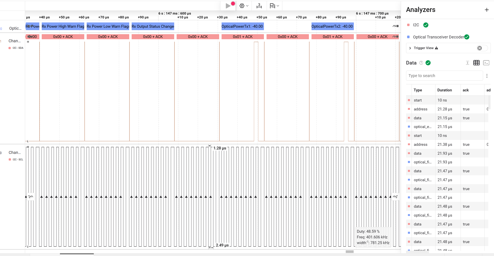

# Optical Transceiver HLA

**Saleae Logic 2 光模块协议解析插件** —— 在 I2C 波形上直接解出 CMIS / SFF-8472 的协议字段。

面向光通信研发、光模块软硬件工程师。把 Logic 2 从"看波形"变成"看协议"，
再进一步变成**能挑出协议自相矛盾之处**的检查器。

```
RD 0x50 pg02 73B | TempMonHighAlarmThreshold: 75.00 °C | TempMonLowAlarmThreshold: -5.00 °C | ...
WR 0x50 pg10 2B  | Page Select -> Page 0x10
RD 0x50 pg10 33B | DP Deinit Lanes: 0x00 (initialize all lanes) | ApplyDPInit: no lanes selected | ...
```



*在 Logic 2 里解码真实 QSFP-DD 模块抓包：右侧 **Analyzers** 面板显示 `I2C` 与本插件已挂载，
左上方是插件解出的字段气泡，右侧 **Data** 表列出了逐字节的 `optical_field` / `optical_event` 行。
（`OpticalPowerTx1: -40.00` 是模块处于低功耗态时的读数，非异常。）*

---

## 功能概览

| | |
| :--- | :--- |
| **协议** | CMIS（QSFP-DD / OSFP / SFP-DD / DSFP）、SFF-8472（SFP/SFP+） |
| **规范依据** | OIF-CMIS-05.4，**每个偏移都标注了规范表号** |
| **覆盖** | Lower Memory 完整、Page 00h/02h/10h/11h/9Fh 全解，约 110 个字段 |
| **输出** | 逐字节 ／ 事务摘要（每个 I2C 事务一行），双模式 |
| **一致性校验** | 6 条规则，能抓出标志寄存器映射错位这类问题 |
| **不确定性** | 无法从抓包推断的量走配置文件，且**输出会标注哪个数是猜的** |

完整清单、验证状态与路线图见 **[FEATURES.md](FEATURES.md)**。

---

## 安装

### 方式一：下载即用（推荐）

从 **[Releases](https://github.com/makemk/optical-transceiver-hla/releases/latest)** 下载
`Optical_Transceiver_HLA_v*.zip`，解压后：

1. 打开 Saleae Logic 2
2. 左侧边栏 **Extensions** → 右上角 **`...`** → **Load Existing Extension...**
3. 选中解压出来的 **`optical_transceiver_hla` 文件夹**（选文件夹，不是文件）

### 方式二：从源码

```bash
git clone https://github.com/makemk/optical-transceiver-hla.git
```

然后同上，选中仓库里的 `extensions/optical_transceiver_hla` 文件夹。

---

加载成功后，**Analyzers** 面板点 `+` 即可看到 **`Optical Transceiver Decoder`**。

> 高级分析器建立在 I2C 之上，需要先添加 I2C 分析器再挂载本插件。
> 详见 [插件使用说明](extensions/optical_transceiver_hla/README.md)。

---

## 快速上手（含真实样例数据）

仓库自带一份**真实模块抓包**，克隆下来就能跑通完整流程：

```
samples/CMIS_IIC.sal             真实 QSFP-DD 模块的 I2C 抓包
samples/cmis_iic_baseline.csv    该抓包的期望解码输出（1740+ 行）
```

**在 Logic 2 里看**：直接打开 `samples/CMIS_IIC.sal`，添加 I2C 分析器（SDA=CH1、SCL=CH0），
再挂上 `Optical Transceiver Decoder`。

**用命令行跑回归**（需要 Logic 2 在运行且开启了 MCP Server）：

```bash
python tools/regression_run.py --out /tmp/out.csv --diff samples/cmis_iic_baseline.csv
```

输出 `IDENTICAL` 说明解码行为与基线一致。

---

## 仓库结构

```
.
├── README.md                  本文件
├── FEATURES.md                功能清单 / 验证状态 / 路线图
├── .gitignore                 仓库边界：什么不进版本库
│
├── extensions/optical_transceiver_hla/     ← 插件本体（这就是要加载的目录）
│   ├── extension.json         插件清单
│   ├── optical_hla.py         入口：HLA 声明、显示过滤、接线
│   ├── i2c_session.py         I2C 层：寻址、页/银行、事务
│   ├── cmis.py                CMIS 寄存器语义（按页分方法）
│   ├── cdb.py                 CDB 命令通道（页 9Fh）
│   ├── sff8472.py             SFF-8472
│   ├── fields.py              层间契约
│   ├── regmap.py              地址常量与编码表
│   ├── decode_utils.py        定点换算、位域展开
│   ├── compliance.py          一致性校验规则
│   ├── aggregate.py           事务摘要渲染
│   ├── user_config.py/json    不确定性配置
│   └── README.md              插件使用说明
│
├── tools/                     测试与工具（不随插件发布）
│   ├── test_optical_simulation.py    契约测试（秒级）
│   ├── test_cmis_registers.py        寄存器语义测试（83 项）
│   ├── regression_run.py             真实抓包回归 + diff
│   ├── package_extension.py          打包成可分发 zip
│   ├── logic2_mcp_bridge.py          Logic 2 MCP 桥接
│   ├── logic2_cli.py                 命令行采集
│   └── analyze_cmis_sal.py           离线分析 .sal
│
├── samples/                   样例数据（有意入库，供他人快速测试）
└── _local/                    本地产物（不进仓库：旧抓包、解码结果、打包 zip）
```

**插件目录不能改名或移动** —— Logic 2 的扩展注册表记录的是它的绝对路径。

---

## 开发

```bash
# 契约测试：必须始终通过，且不应修改
python tools/test_optical_simulation.py

# 寄存器语义 / 配置 / 输出模式 / 一致性规则（83 项，均标注规范表号）
python tools/test_cmis_registers.py

# 真实抓包回归
python tools/regression_run.py --out out.csv --diff samples/cmis_iic_baseline.csv
```

改动代码后**纯重构必须得到 `IDENTICAL`**。这条判据在开发中拦下过 4 个真实 bug。

### 架构约定

代码分四层，**单向依赖**：

```
optical_hla.py  →  cmis.py / cdb.py / sff8472.py  →  i2c_session.py  →  fields.py
```

- **I2C 层不知道任何寄存器含义**，协议层也不知道 I2C 帧长什么样
- 加一个新页 = 在 `cmis.py` 加一个 `_pageXX` 方法 + 在 `_PAGES` 注册一行
- 协议解码器返回三种值，语义必须严格区分：`Field`（解出字段）／`CONSUMED`（字节认领了但字段没凑齐）／`None`（不是我的寄存器）

热重载：改任何模块后在 Logic 2 里按 **`Ctrl + R`** 即可，无需重启。

---

## 状态

**v2.0.0** — 可用，核心路径经真实抓包验证。

⚠️ 各部分的验证强度不同，**用之前请对照 [FEATURES.md §3 验证状态](FEATURES.md#三验证状态重要)**。
其中 Page 9Fh（CDB 命令通道）**只经过单元测试**，开发时手头的抓包从未选过该页。

尚未实现的部分（固件升级流程状态机、Page 04h/12h/13h/14h/0Dh 等）见
[FEATURES.md §4](FEATURES.md#四尚未实现--待未来)。

---

## 样例数据说明

`samples/CMIS_IIC.sal` 是真实 QSFP-DD 模块的 I2C 抓包，**有意随仓库分发** ——
没有真实数据的话，别人克隆下来无法跑回归测试。

该抓包中模块处于低功耗态，大部分寄存器为零；**不含厂商名、序列号等身份信息**
（抓包未读取身份区）。

---

## 许可

尚未指定。在此之前，默认保留所有权利。

---

## 相关文档

| 文档 | 内容 |
| :--- | :--- |
| [FEATURES.md](FEATURES.md) | 支持哪些功能、哪些已验证、还差什么、已知限制 |
| [插件 README](extensions/optical_transceiver_hla/README.md) | 安装、使用、字段速查表、不确定性配置 |
